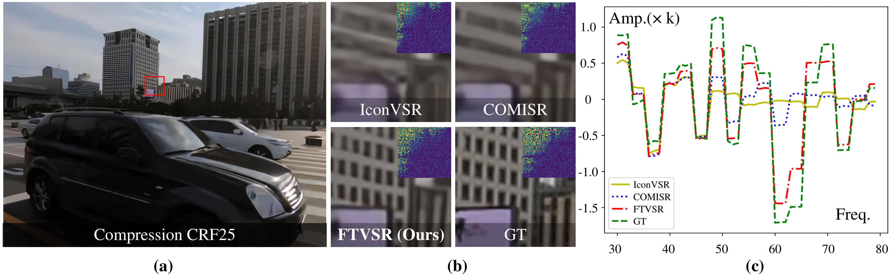
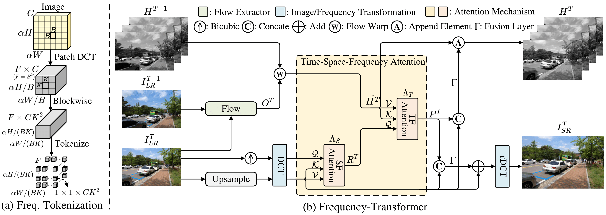

# FTVSR (ECCV 2022)
This is the official PyTorch implementation of the paper Learning Spatiotemporal Frequency-Transformer for Compressed Video Super-Resolution.

## Contents
- [Introduction](#introduction)
  - [Contribution](#contribution)
  - [Overview](#overview)
  - [Visual](#visual)
- [Requirements and dependencies](#requirements-and-dependencies)
- [Model](#model)
- [Dataset](#dataset)
- [Test](#test)
- [Train](#train)
- [Related projects](#related-projects)
- [Citation](#citation)
- [Acknowledgment](#acknowledgment)

## Introduction
Compressed video super-resolution (VSR) aims to restore high-resolution frames from compressed low-resolution counterparts. Most recent VSR approaches often enhance an input frame by “borrowing” relevant textures from neighboring video frames. Although some progress has been made, there are grand challenges to effectively extract and transfer high-quality textures from compressed videos where most frames are usually highly degraded. 
we propose a novel Frequency-Transformer for compressed Video Super-Resolution (FTVSR) that conducts self-attention over a joint space-time-frequency domain. FTVSR significantly outperforms previous methods and achieves new SOTA results. 



### Contribution
We propose transfering video frames into frequecy domain design a novel frequency attention mechanism. 
We study the different self-attention schemes among space, time and frequency dimensions.
We propose a novel Frequency-Transformer for compressed Video Super-Resolution (FTVSR) that conducts self-attention over a joint space-time-frequency domain. 

### Overview



### Visual
Some visual results on videos with different compression rates (No compression, CRF 15, 25, 35).


## Requirements and dependencies
* python 3.7 (recommend to use [Anaconda](https://www.anaconda.com/))
* pytorch == 1.9.0
* torchvision == 0.10.0
* opencv-python == 4.5.3
* mmcv-full == 1.3.9
* scipy==1.7.3
* scikit-image == 0.19.0
* lmdb == 1.2.1
* yapf == 0.31.0
* tensorboard == 2.6.0

## Model
Pre-trained models can be downloaded from [baidu cloud](https://pan.baidu.com/s/1ZIq6T98Iv1oGk7rC46WACg)(i42r) or Google drive.
* *FTVSR_REDS.pth*: trained on REDS dataset with 50% uncompressed videos and 50% compressed videos (CRF 15, 25, 35).
* *TTVSR_Vimeo90K.pth*: trained on Vimeo-90K dataset with 50% uncompressed videos and 50% compressed videos (CRF 15, 25, 35).


## Dataset

1. Training set
	* [REDS](https://seungjunnah.github.io/Datasets/reds.html) dataset. We regroup the training and validation dataset into one folder. The original training dataset has 240 clips from 000 to 239. The original validation dataset were renamed from 240 to 269.
		- Make REDS structure be:
	    ```
			├────REDS
				├────train
					├────train_sharp
						├────000
						├────...
						├────269
					├────train_sharp_bicubic
						├────X4
							├────000
							├────...
							├────269
        ```
	* [Viemo-90K](https://github.com/anchen1011/toflow) dataset. Download the [original data](http://data.csail.mit.edu/tofu/dataset/vimeo_septuplet.zip) and use the script 'degradation/BD_degradation.m' (run in MATLAB) to generate the low-resolution images. The `sep_trainlist.txt` file listing the training samples in the download zip file.
		- Make Vimeo-90K structure be:
		```
			├────vimeo_septuplet
				├────sequences
					├────00001
					├────...
					├────00096
				├────sequences_BD
					├────00001
					├────...
					├────00096
				├────sep_trainlist.txt
				├────sep_testlist.txt
        ```
	* Generate the compressed videos by ffmpeg with command "ffmpeg -i LR.mp4 -vcodec libx264 -crf CRFvalue LR_compressed.mp4". We train FTVSR on the 50% uncompressed videos and 50% compressed videos with CRF 15, 25, and 35.

2. Testing set
	* [REDS4](https://seungjunnah.github.io/Datasets/reds.html) and [Vid4](https://www.terabox.com/web/share/link?surl=LMuQCVntRegfZSxn7s3hXw&path=%2Fproject%2Fpfnl) dataset. The 000, 011, 015, 020 clips from the original training dataset of REDS. Download the compressed testing videos from [baidu cloud](https://pan.baidu.com/s/1ZIq6T98Iv1oGk7rC46WACg) or Google drive.


## Test
1. Clone this github repo
```
git clone https://github.com/researchmm/FTVSR.git
cd FTVSR
```
2. Download pre-trained weights ([baidu cloud](https://pan.baidu.com/s/1ZIq6T98Iv1oGk7rC46WACg) | Google drive) under `./checkpoint`
3. Prepare testing dataset and modify "dataset_root" in `configs/FTVSR_reds4.py` and `configs/FTVSR_vimeo90k.py`
4. Run test
```
# REDS model
CUDA_VISIBLE_DEVICES=0,1,2,3,4,5,6,7 ./tools/dist_test.sh configs/FTVSR_reds4.py checkpoint/FTVSR_REDS.pth 8 [--save-path 'save_path']
# Vimeo model
CUDA_VISIBLE_DEVICES=0,1,2,3,4,5,6,7 ./tools/dist_test.sh configs/FTVSR_vimeo90k.py checkpoint/FTVSR_Vimeo90K.pth 8 [--save-path 'save_path']
```
5. The results are saved in `save_path`.

## Train
1. Clone this github repo
```
git clone https://github.com/researchmm/FTVSR.git
cd FTVSR
```
2. Prepare training dataset and modify "dataset_root" in `configs/FTVSR_reds4.py` and `configs/FTVSR_vimeo90k.py`
3. Run training
```
# REDS
CUDA_VISIBLE_DEVICES=0,1,2,3,4,5,6,7 ./tools/dist_train.sh configs/FTVSR_reds4.py 8
# Vimeo
CUDA_VISIBLE_DEVICES=0,1,2,3,4,5,6,7 ./tools/dist_train.sh configs/FTVSR_vimeo90k.py 8
```

## Related projects
We also sincerely recommend some other excellent works related to us. :sparkles: 
* [Learning Trajectory-Aware Transformer for Video Super-Resolution](https://github.com/researchmm/TTVSR)
* [TTSR: Learning Texture Transformer Network for Image Super-Resolution](https://github.com/researchmm/TTSR)
* [Learning Conditional Knowledge Distillation for Degraded-Reference Image Quality Assessment](https://github.com/researchmm/CKDN)

## Citation
If you find the code and pre-trained models useful for your research, please consider citing our paper. :blush:
```
@InProceedings{qiu2022learning,
author = {Qiu, Zhongwei and Yang, Huan and Fu, Jianlong and Fu, Dongmei},
title = {Learning Spatiotemporal Frequency-Transformer for Compressed Video Super-Resolution},
booktitle = {ECCV},
year = {2022},
}
```

## Acknowledgment
This code is built on [mmediting](https://github.com/open-mmlab/mmediting). We thank the authors of [BasicVSR](https://github.com/ckkelvinchan/BasicVSR-IconVSR) for sharing their code.


